# Database Models

## Overview

This document describes the database schema, including all models, their fields,
relationships, and constraints.

## Entity Relationship Diagram

```mermaid
erDiagram
    Base {
    }
    Project {
        Mapped id
        Mapped name
        Mapped description
        Mapped repo_url
        Mapped language
    }
    Feature {
        Mapped id
        Mapped project_id
        Mapped title
        Mapped description
        Mapped status
    }
    Task {
        Mapped id
        Mapped feature_id
        Mapped title
        Mapped description
        Mapped status
    }
    QualityGate {
        Mapped id
        Mapped name
        Mapped gate_type
        Mapped tier
        Mapped enabled
    }
    GateResult {
        Mapped id
        Mapped task_id
        Mapped gate_name
        Mapped status
        Mapped evidence
    }
    ApprovalGate {
        Mapped id
        Mapped task_id
        Mapped gate_type
        Mapped status
        Mapped created_at
    }
    Approval {
        Mapped id
        Mapped approval_gate_id
        Mapped approver_email
        Mapped decision
        Mapped comment
    }
    AgentRun {
        Mapped id
        Mapped task_id
        Mapped agent_name
        Mapped agent_version_sha
        Mapped session_id
    }
    AgentRunEvent {
        Mapped id
        Mapped run_id
        Mapped event_type
        Mapped tool_name
        Mapped tool_input
    }
```

## Models

### Base

Base class for all models.

### Project

**Table**: `projects`

**Fields**:

- **id** (Mapped)
- **name** (Mapped)
- **description** (Mapped)
- **repo_url** (Mapped)
- **language** (Mapped)
- **created_at** (Mapped)
- **updated_at** (Mapped)

### Feature

**Table**: `features`

**Fields**:

- **id** (Mapped)
- **project_id** (Mapped)
- **title** (Mapped)
- **description** (Mapped)
- **status** (Mapped)
- **priority** (Mapped)
- **created_at** (Mapped)
- **updated_at** (Mapped)

### Task

**Table**: `tasks`

**Fields**:

- **id** (Mapped)
- **feature_id** (Mapped)
- **title** (Mapped)
- **description** (Mapped)
- **status** (Mapped)
- **depends_on** (Mapped)
- **complexity** (Mapped)
- **retry_count** (Mapped)
- **blocked_reason** (Mapped)
- **blocked_at** (Mapped)
- **capability_limit_at** (Mapped)
- **capability_limit_reason** (Mapped)
- **dead_letter_queued_at** (Mapped)
- **created_at** (Mapped)
- **updated_at** (Mapped)

### QualityGate

Gate configuration — what gates exist and their settings.

**Table**: `quality_gates`

**Fields**:

- **id** (Mapped)
- **name** (Mapped)
- **gate_type** (Mapped)
- **tier** (Mapped)
- **enabled** (Mapped)
- **timeout_seconds** (Mapped)
- **config** (Mapped)

### GateResult

**Table**: `gate_results`

**Fields**:

- **id** (Mapped)
- **task_id** (Mapped)
- **gate_name** (Mapped)
- **status** (Mapped)
- **evidence** (Mapped)
- **findings_count** (Mapped)
- **elapsed_ms** (Mapped)
- **error_code** (Mapped)
- **timeout** (Mapped)
- **remediation_attempted** (Mapped)
- **remediation_succeeded** (Mapped)
- **retry_of** (Mapped)
- **analysis_depth** (Mapped)
- **created_at** (Mapped)

### ApprovalGate

**Table**: `approval_gates`

**Fields**:

- **id** (Mapped)
- **task_id** (Mapped)
- **gate_type** (Mapped)
- **status** (Mapped)
- **created_at** (Mapped)
- **resolved_at** (Mapped)

### Approval

**Table**: `approvals`

**Fields**:

- **id** (Mapped)
- **approval_gate_id** (Mapped)
- **approver_email** (Mapped)
- **decision** (Mapped)
- **comment** (Mapped)
- **created_at** (Mapped)

### AgentRun

**Table**: `agent_runs`

**Fields**:

- **id** (Mapped)
- **task_id** (Mapped)
- **agent_name** (Mapped)
- **agent_version_sha** (Mapped)
- **session_id** (Mapped)
- **cost_usd** (Mapped)
- **tokens_input** (Mapped)
- **tokens_output** (Mapped)
- **tokens_cached** (Mapped)
- **num_turns** (Mapped)
- **duration_ms** (Mapped)
- **stop_reason** (Mapped)
- **status** (Mapped)
- **error** (Mapped)
- **started_at** (Mapped)
- **completed_at** (Mapped)

### AgentRunEvent

**Table**: `agent_run_events`

**Fields**:

- **id** (Mapped)
- **run_id** (Mapped)
- **event_type** (Mapped)
- **tool_name** (Mapped)
- **tool_input** (Mapped)
- **output_preview** (Mapped)
- **timestamp** (Mapped)

### Workspace

**Table**: `workspaces`

**Fields**:

- **id** (Mapped)
- **task_id** (Mapped)
- **path** (Mapped)
- **branch** (Mapped)
- **is_worktree** (Mapped)
- **created_at** (Mapped)
- **cleaned_at** (Mapped)

### DesignDocument

**Table**: `design_documents`

**Fields**:

- **id** (Mapped)
- **task_id** (Mapped)
- **doc_type** (Mapped)
- **title** (Mapped)
- **content** (Mapped)
- **version** (Mapped)
- **created_at** (Mapped)

### HarnessabilityReport

**Table**: `harnessability_reports`

**Fields**:

- **id** (Mapped)
- **project_id** (Mapped)
- **score** (Mapped)
- **checks** (Mapped)
- **recommendations** (Mapped)
- **routing_action** (Mapped)
- **created_at** (Mapped)

### ApprovalLog

Immutable, append-only audit trail. No UPDATE or DELETE allowed.

Enforced at application layer — no update/delete methods exposed.

**Table**: `approval_log`

**Fields**:

- **id** (Mapped)
- **task_id** (Mapped)
- **approver_email** (Mapped)
- **decision** (Mapped)
- **reason** (Mapped)
- **timestamp** (Mapped)

### SecurityFinding

Security findings detected by PreToolUse/PostToolUse hooks.

Stores prompt injection, egress, and other security events for audit and analysis.

**Table**: `security_findings`

**Fields**:

- **id** (Mapped)
- **run_id** (Mapped)
- **finding_type** (Mapped)
- **severity** (Mapped)
- **tool_name** (Mapped)
- **pattern** (Mapped)
- **context_preview** (Mapped)
- **timestamp** (Mapped)

### ChatSession

Chat sessions for the agent chat interface.

Stores conversation history for persistence across page reloads.

**Table**: `chat_sessions`

**Fields**:

- **id** (Mapped)
- **sdk_session_id** (Mapped)
- **created_at** (Mapped)
- **updated_at** (Mapped)

### ChatMessage

Individual messages in a chat session.

**Table**: `chat_messages`

**Fields**:

- **id** (Mapped)
- **session_id** (Mapped)
- **role** (Mapped)
- **content** (Mapped)
- **tokens_used** (Mapped)
- **cost_usd** (Mapped)
- **created_at** (Mapped)

## Database Configuration

- **ORM**: SQLAlchemy (async)
- **Migrations**: Alembic
- **Supported Databases**: PostgreSQL, SQLite

## Relationships

Models are connected through foreign keys and SQLAlchemy relationships:
- One-to-Many: Project → Features, Feature → Tasks
- Many-to-One: Task → Feature, Feature → Project
- One-to-One: Task → Workspace

## Indexes

Indexes are automatically created for:
- Primary keys
- Foreign keys
- Unique constraints
- Commonly queried fields (status, created_at)

