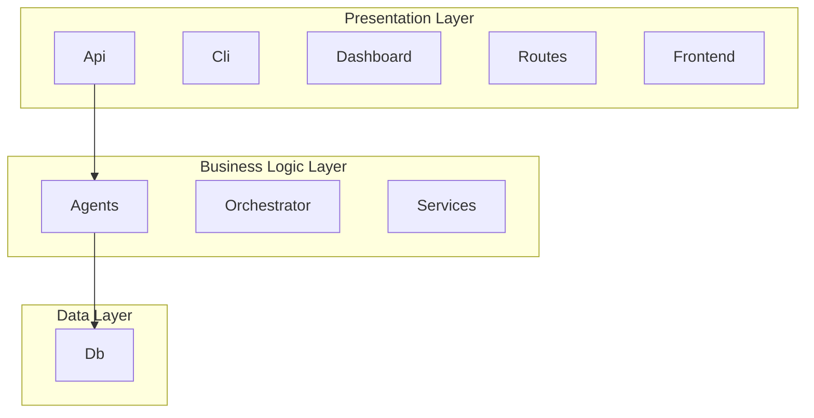

# System Architecture

## Architecture Overview

This document describes the high-level architecture of the system,
including its components, layers, and their relationships.

## Architecture Diagram

## Architectural Layers

### Presentation Layer

Handles user interaction and external communication

**Components**: Api, Routes, Cli, Dashboard, Frontend

### Business Logic Layer

Implements core business rules and workflows

**Components**: Agents, Orchestrator, Services

### Data Layer

Manages data persistence and retrieval

**Components**: Db

### Cross-Cutting Concerns

Provides system-wide capabilities

**Components**: Security, Quality_Gates, Knowledge

## Components

### Agents

**Purpose**: Agent system - autonomous task execution

**Location**: `src\autonomous_agent_builder\agents`

### Api

**Purpose**: API layer - handles HTTP requests and responses

**Location**: `src\autonomous_agent_builder\api`

### Cli

**Purpose**: Command-line interface

**Location**: `src\autonomous_agent_builder\cli`

### Dashboard

**Purpose**: Web dashboard - user interface

**Location**: `src\autonomous_agent_builder\dashboard`

### Db

**Purpose**: Database layer - data models and persistence

**Location**: `src\autonomous_agent_builder\db`

### Embedded

**Purpose**: Embedded components

**Location**: `src\autonomous_agent_builder\embedded`

### Knowledge

**Purpose**: Knowledge management system

**Location**: `src\autonomous_agent_builder\knowledge`

### Orchestrator

**Purpose**: Orchestration layer - coordinates workflows

**Location**: `src\autonomous_agent_builder\orchestrator`

### Quality_Gates

**Purpose**: Quality gates - automated checks and validations

**Location**: `src\autonomous_agent_builder\quality_gates`

### Security

**Purpose**: Security layer - authentication and authorization

**Location**: `src\autonomous_agent_builder\security`

### Services

**Purpose**: Service layer - business logic

**Location**: `src\autonomous_agent_builder\services`

### Routes

**Purpose**: API routes - defines endpoints and handlers

**Location**: `src\autonomous_agent_builder\api\routes`

### Frontend

**Purpose**: Frontend application

**Location**: `frontend`

## Integration Points

The system integrates with:
- Database (for persistence)
- External APIs (if applicable)
- File system (for storage)

## Data Flow

Data flows through the system in the following pattern:
1. Request received at API layer
2. Validation and processing in service layer
3. Data persistence in database layer
4. Response returned to client

