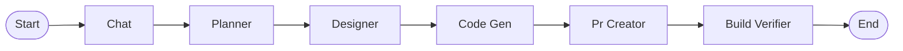

# Workflows and Orchestration

## Overview

This document describes the system's workflows, orchestration patterns,
and execution phases.

## Workflow Diagram

## Execution Phases

### Chat

General-purpose conversational agent for project assistance

**Model**: sonnet

**Max Turns**: 15

**Tools**: Read, Glob, Grep, mcp__builder__kb_search, mcp__builder__memory_search, mcp__builder__task_list, mcp__builder__task_show

### Planner

Break features into implementation tasks with dependencies

**Model**: opus

**Max Turns**: 20

**Tools**: Read, Glob, Grep, mcp__builder__kb_search, mcp__builder__memory_search

### Designer

Create architecture decisions and API contracts

**Model**: opus

**Max Turns**: 20

**Tools**: Read, Glob, Grep, mcp__builder__kb_add, mcp__builder__kb_search, mcp__builder__memory_search

### Code Gen

Implement features in isolated workspace

**Model**: sonnet

**Max Turns**: 30

**Tools**: Read, Edit, Write, Bash, Glob, Grep, mcp__workspace__run_tests, mcp__workspace__run_linter (and 3 more)

### Pr Creator

Create pull requests with quality evidence

**Model**: sonnet

**Max Turns**: 15

**Tools**: Read, Bash, Glob, Grep

### Build Verifier

Verify post-merge build and integration tests pass

**Model**: sonnet

**Max Turns**: 10

**Tools**: Read, Bash, Glob, Grep

## Orchestration Patterns

### Deterministic Dispatch

The orchestrator uses deterministic dispatch based on task status:
- Task status determines which phase handler to invoke
- No agent self-routing - orchestrator owns all routing decisions
- Predictable execution flow

### Phase Chaining

Phases can chain together:
- Output of one phase becomes input to next
- Session context passed between phases
- Enables complex multi-step workflows

### Error Handling

Workflow error handling:
- Gate failures trigger autofix attempts
- Retry logic with configurable limits
- CAPABILITY_LIMIT for unrecoverable errors
- Dead-letter queue for failed tasks

### Concurrent Execution

Quality gates run concurrently:
- asyncio.gather for parallel execution
- Per-gate timeouts
- AND aggregation (all must pass)

