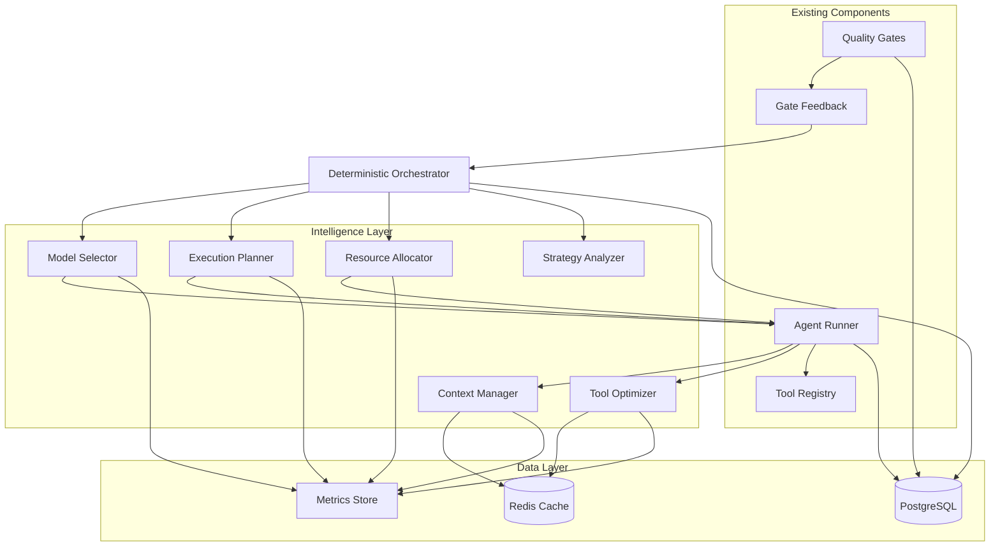
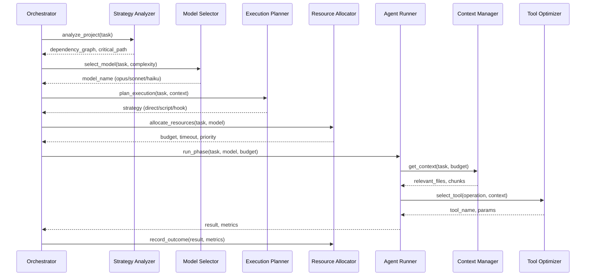

# Design Document: Intelligent Autonomous Orchestration

## Overview

This feature adds intelligent decision-making capabilities to the autonomous-agent-builder orchestrator. The system will make strategic decisions about context retrieval, model selection, tool usage, execution patterns, and resource allocation to optimize cost, quality, and speed while maintaining autonomous operation.

The design introduces five new intelligent components that work alongside the existing deterministic orchestrator:

1. **Context_Manager**: Smart context retrieval with relevance scoring and caching
2. **Model_Selector**: Dynamic model selection based on task complexity
3. **Tool_Optimizer**: Optimal tool selection for information retrieval
4. **Execution_Planner**: Strategic decision-making for implementation approach
5. **Resource_Allocator**: Budget and resource management with multi-objective optimization

These components integrate with the existing architecture (Claude Agent SDK, deterministic orchestrator, quality gates) without replacing the core dispatch logic. The orchestrator remains deterministic in phase routing but gains intelligence in execution strategy.

## Architecture

### High-Level Architecture



### Component Integration Points

The intelligence layer integrates at these points:

1. **Pre-Phase Planning** (Orchestrator → Strategy_Analyzer)
   - Analyze project structure before task dispatch
   - Build dependency graph and critical path
   - Estimate resource requirements

2. **Phase Dispatch** (Orchestrator → Model_Selector + Execution_Planner)
   - Select optimal model for the phase
   - Determine execution strategy (direct/script/hook)
   - Allocate budget and resources

3. **Agent Execution** (Agent_Runner → Context_Manager + Tool_Optimizer)
   - Retrieve relevant context efficiently
   - Select optimal tools for operations
   - Manage context window dynamically

4. **Post-Execution Learning** (Agent_Runner → Metrics Store)
   - Record decision outcomes
   - Track success metrics
   - Update decision criteria

### Data Flow



## Components and Interfaces

### 1. Context_Manager

**Purpose**: Efficiently retrieve and manage codebase context with relevance scoring and caching.

**Interface**:

```python
class ContextManager:
    async def get_relevant_context(
        self,
        task: Task,
        max_tokens: int,
        workspace_path: str
    ) -> ContextResult:
        """Retrieve relevant context for a task within token budget."""
        
    async def prioritize_files(
        self,
        files: list[str],
        task_description: str
    ) -> list[tuple[str, float]]:
        """Score and rank files by relevance."""
        
    async def chunk_and_prioritize(
        self,
        file_path: str,
        max_tokens: int
    ) -> list[ContentChunk]:
        """Split large files into prioritized chunks."""
        
    async def get_cached(self, key: str) -> Any | None:
        """Retrieve from cache if available."""
        
    async def set_cached(self, key: str, value: Any, ttl: int) -> None:
        """Store in cache with TTL."""
        
    def track_usage(self, file_path: str) -> None:
        """Track file access for LRU eviction."""
```

**Key Algorithms**:

- **Relevance Scoring**: TF-IDF + keyword matching + dependency analysis
- **Caching Strategy**: LRU eviction with file modification detection
- **Context Window Management**: Priority queue with dynamic allocation

**Storage**:

```python
@dataclass
class ContextResult:
    files: list[FileContext]
    total_tokens: int
    cache_hits: int
    retrieval_time_ms: int

@dataclass
class FileContext:
    path: str
    content: str
    relevance_score: float
    tokens: int
    cached: bool

@dataclass
class ContentChunk:
    content: str
    start_line: int
    end_line: int
    relevance_score: float
    tokens: int
```

### 2. Model_Selector

**Purpose**: Select the optimal Claude model based on task complexity analysis.

**Interface**:

```python
class ModelSelector:
    def select_model(
        self,
        task: Task,
        phase: str,
        context: dict[str, Any]
    ) -> ModelSelection:
        """Select model based on complexity analysis."""
        
    def analyze_complexity(
        self,
        task: Task,
        phase: str
    ) -> ComplexityScore:
        """Analyze task complexity across multiple dimensions."""
        
    def escalate_model(
        self,
        current_model: str,
        failure_reason: str
    ) -> str | None:
        """Escalate to more capable model on failure."""
        
    def track_selection(
        self,
        task_id: str,
        model: str,
        success: bool,
        metrics: dict[str, Any]
    ) -> None:
        """Record selection outcome for learning."""
```

**Complexity Analysis Dimensions**:

1. **Task Type**: planning (opus), design (opus), implementation (sonnet), simple ops (haiku)
2. **File Change Scope**: 1-3 files (haiku), 4-10 files (sonnet), 10+ files (opus)
3. **Acceptance Criteria Count**: 1-2 (haiku), 3-5 (sonnet), 6+ (opus)
4. **Dependency Complexity**: isolated (haiku), local deps (sonnet), cross-module (opus)
5. **Historical Success Rate**: track per-model success for similar tasks

**Decision Matrix**:

```python
@dataclass
class ComplexityScore:
    task_type_score: int  # 1-3
    scope_score: int      # 1-3
    criteria_score: int   # 1-3
    dependency_score: int # 1-3
    total: int            # sum of above
    
    def recommended_model(self) -> str:
        if self.total >= 10: return "opus"
        if self.total >= 6: return "sonnet"
        return "haiku"

@dataclass
class ModelSelection:
    model: str
    confidence: float
    reasoning: str
    complexity_score: ComplexityScore
    estimated_cost: float
```

### 3. Tool_Optimizer

**Purpose**: Select optimal tools for information retrieval operations.

**Interface**:

```python
class ToolOptimizer:
    def select_tool(
        self,
        operation: ToolOperation,
        context: dict[str, Any]
    ) -> ToolChoice:
        """Select optimal tool for operation."""
        
    def estimate_cost(
        self,
        tool: str,
        params: dict[str, Any]
    ) -> ToolCostEstimate:
        """Estimate token cost and execution time."""
        
    def should_batch(
        self,
        operations: list[ToolOperation]
    ) -> list[list[ToolOperation]]:
        """Group operations for batching."""
        
    def track_usage(
        self,
        tool: str,
        success: bool,
        metrics: dict[str, Any]
    ) -> None:
        """Record tool usage for optimization."""
```

**Tool Selection Rules**:

```python
class ToolOperation(Enum):
    SEARCH_STRING = "search_string"
    SEARCH_SEMANTIC = "search_semantic"
    READ_SMALL_FILE = "read_small_file"
    READ_LARGE_FILE = "read_large_file"
    EXPLORE_DIRECTORY = "explore_directory"
    FIND_FILES = "find_files"

TOOL_SELECTION_RULES = {
    ToolOperation.SEARCH_STRING: {
        "preferred": "Grep",
        "fallback": "Read",
        "condition": "pattern is regex-compatible"
    },
    ToolOperation.EXPLORE_DIRECTORY: {
        "preferred": "Glob",
        "fallback": "Bash",
        "condition": "pattern is glob-compatible"
    },
    ToolOperation.READ_SMALL_FILE: {
        "preferred": "Read",
        "condition": "file_size < 500 lines"
    },
    ToolOperation.READ_LARGE_FILE: {
        "preferred": "Read with line ranges",
        "condition": "file_size >= 500 lines"
    },
    ToolOperation.SEARCH_SEMANTIC: {
        "preferred": "mcp__builder__kb_search",
        "fallback": "Grep",
        "condition": "semantic search available"
    }
}
```

**Cost Estimation**:

```python
@dataclass
class ToolCostEstimate:
    tool: str
    estimated_tokens: int
    estimated_time_ms: int
    confidence: float

@dataclass
class ToolChoice:
    tool: str
    params: dict[str, Any]
    reasoning: str
    cost_estimate: ToolCostEstimate
```

### 4. Execution_Planner

**Purpose**: Determine optimal implementation strategy (direct/script/hook).

**Interface**:

```python
class ExecutionPlanner:
    def plan_execution(
        self,
        task: Task,
        context: dict[str, Any]
    ) -> ExecutionPlan:
        """Determine execution strategy."""
        
    def detect_repetition(
        self,
        task_description: str
    ) -> RepetitionAnalysis:
        """Identify repetitive patterns."""
        
    def estimate_maintenance_cost(
        self,
        strategy: ExecutionStrategy
    ) -> float:
        """Estimate long-term maintenance cost."""
        
    def track_strategy(
        self,
        task_id: str,
        strategy: ExecutionStrategy,
        success: bool
    ) -> None:
        """Record strategy outcome."""
```

**Strategy Decision Tree**:

```python
class ExecutionStrategy(Enum):
    DIRECT = "direct"           # One-time implementation
    SCRIPT = "script"           # Reusable script
    HOOK = "hook"               # Event-driven automation

@dataclass
class RepetitionAnalysis:
    is_repetitive: bool
    frequency_estimate: str  # "one-time", "occasional", "frequent"
    pattern_type: str        # "file-based", "event-based", "scheduled"
    confidence: float

@dataclass
class ExecutionPlan:
    strategy: ExecutionStrategy
    reasoning: str
    estimated_effort: int  # story points
    maintenance_cost: float
    artifacts: list[str]  # files to create
```

**Decision Logic**:

1. **Direct**: One-time task, no repetition detected, low maintenance
2. **Script**: Repetitive operations, command-line invocation, reusable
3. **Hook**: Event-driven, file-based triggers, automation opportunity

### 5. Resource_Allocator

**Purpose**: Manage budget, time, and computational resources with multi-objective optimization.

**Interface**:

```python
class ResourceAllocator:
    def allocate_resources(
        self,
        task: Task,
        model: str,
        priority: TaskPriority
    ) -> ResourceAllocation:
        """Allocate resources based on task priority."""
        
    def estimate_budget(
        self,
        task: Task,
        model: str,
        complexity: ComplexityScore
    ) -> BudgetEstimate:
        """Estimate token budget for task."""
        
    def check_budget_available(
        self,
        project_id: str,
        requested: float
    ) -> bool:
        """Check if budget is available."""
        
    def track_usage(
        self,
        task_id: str,
        actual_cost: float,
        actual_tokens: int
    ) -> None:
        """Record actual usage for future estimates."""
        
    def optimize_allocation(
        self,
        objectives: OptimizationObjectives
    ) -> ResourceAllocation:
        """Multi-objective optimization."""
```

**Resource Management**:

```python
@dataclass
class ResourceAllocation:
    max_budget_usd: float
    max_tokens: int
    max_turns: int
    timeout_seconds: int
    priority: TaskPriority
    
@dataclass
class BudgetEstimate:
    estimated_cost: float
    confidence_interval: tuple[float, float]
    based_on_samples: int

class TaskPriority(Enum):
    CRITICAL = "critical"  # Critical path, high budget
    HIGH = "high"          # Important, normal budget
    NORMAL = "normal"      # Standard allocation
    LOW = "low"            # Best-effort, low budget

@dataclass
class OptimizationObjectives:
    cost_weight: float = 0.33
    quality_weight: float = 0.33
    speed_weight: float = 0.34
    
    def score_option(
        self,
        cost: float,
        quality: float,
        speed: float
    ) -> float:
        """Calculate weighted score."""
        return (
            (1 - cost) * self.cost_weight +
            quality * self.quality_weight +
            speed * self.speed_weight
        )
```

### 6. Strategy_Analyzer

**Purpose**: Analyze project structure and determine optimal build strategy.

**Interface**:

```python
class StrategyAnalyzer:
    async def analyze_project(
        self,
        project_id: str,
        workspace_path: str
    ) -> ProjectAnalysis:
        """Analyze project structure and dependencies."""
        
    async def build_dependency_graph(
        self,
        tasks: list[Task]
    ) -> DependencyGraph:
        """Build task dependency graph."""
        
    async def identify_critical_path(
        self,
        graph: DependencyGraph
    ) -> list[str]:
        """Identify critical path through tasks."""
        
    async def identify_patterns(
        self,
        project_id: str
    ) -> list[Pattern]:
        """Identify reusable patterns from history."""
```

**Dependency Analysis**:

```python
@dataclass
class DependencyGraph:
    nodes: dict[str, TaskNode]
    edges: list[tuple[str, str]]
    critical_path: list[str]
    
@dataclass
class TaskNode:
    task_id: str
    dependencies: list[str]
    dependents: list[str]
    estimated_duration: int
    priority: TaskPriority

@dataclass
class ProjectAnalysis:
    module_structure: dict[str, list[str]]
    dependency_graph: DependencyGraph
    critical_path: list[str]
    estimated_completion: int  # hours
    risk_areas: list[str]
    reusable_patterns: list[Pattern]

@dataclass
class Pattern:
    name: str
    description: str
    frequency: int
    last_used: datetime
    success_rate: float
```

### 7. Quality_Gate_Coordinator

**Purpose**: Intelligently select which quality gates to run based on file changes and task context.

**Interface**:

```python
class QualityGateCoordinator:
    def select_gates(
        self,
        task: Task,
        changed_files: list[str]
    ) -> list[QualityGate]:
        """Select relevant quality gates based on changes."""
        
    def analyze_file_changes(
        self,
        changed_files: list[str]
    ) -> FileChangeAnalysis:
        """Analyze what types of files changed."""
        
    def should_skip_gate(
        self,
        gate: QualityGate,
        analysis: FileChangeAnalysis
    ) -> bool:
        """Determine if gate can be skipped."""
        
    def track_gate_execution(
        self,
        task_id: str,
        gate_name: str,
        execution_time: int,
        findings: int
    ) -> None:
        """Track gate execution metrics."""
```

**Gate Selection Logic**:

```python
@dataclass
class FileChangeAnalysis:
    has_python_code: bool
    has_security_sensitive: bool
    has_dependencies: bool
    has_documentation_only: bool
    file_types: set[str]
    security_paths: list[str]  # auth, crypto, permissions

class GateSelectionRules:
    """Rules for gate selection based on file changes."""
    
    @staticmethod
    def select_for_python(analysis: FileChangeAnalysis) -> list[str]:
        gates = []
        if analysis.has_python_code:
            gates.extend(["code_quality", "testing"])
        if analysis.has_security_sensitive:
            gates.append("security")
        if analysis.has_dependencies:
            gates.append("dependency")
        return gates
    
    @staticmethod
    def can_skip_all(analysis: FileChangeAnalysis) -> bool:
        """Documentation-only changes skip all gates."""
        return (
            analysis.has_documentation_only and
            not analysis.has_python_code and
            not analysis.has_dependencies
        )

@dataclass
class GateSelection:
    gates: list[QualityGate]
    skipped_gates: list[str]
    reasoning: dict[str, str]
    estimated_time: int
```

### 8. Approval_Coordinator

**Purpose**: Determine when human approval is required based on risk assessment.

**Interface**:

```python
class ApprovalCoordinator:
    def assess_risk(
        self,
        task: Task,
        changed_files: list[str],
        gate_results: AggregateGateResult | None = None
    ) -> RiskAssessment:
        """Assess risk level for autonomous execution."""
        
    def requires_approval(
        self,
        risk: RiskAssessment
    ) -> bool:
        """Determine if approval is required."""
        
    def create_approval_gate(
        self,
        task: Task,
        risk: RiskAssessment
    ) -> ApprovalGate:
        """Create approval gate with context."""
        
    def track_approval_pattern(
        self,
        task_id: str,
        risk_level: str,
        approved: bool,
        feedback: str | None
    ) -> None:
        """Learn from approval patterns."""
```

**Risk Assessment**:

```python
class RiskLevel(Enum):
    LOW = "low"           # Proceed autonomously
    MEDIUM = "medium"     # Proceed with logging
    HIGH = "high"         # Require approval
    CRITICAL = "critical" # Require approval + review

@dataclass
class RiskAssessment:
    level: RiskLevel
    score: float  # 0.0-1.0
    factors: dict[str, float]
    reasoning: str
    requires_approval: bool

class RiskFactors:
    """Risk scoring factors."""
    
    SECURITY_PATHS = [
        "auth", "authentication", "authorization",
        "crypto", "security", "permissions", "secrets"
    ]
    
    ARCHITECTURAL_PATTERNS = [
        "architecture", "design", "interface", "contract",
        "schema", "migration", "model"
    ]
    
    @staticmethod
    def score_file_risk(file_path: str) -> float:
        """Score individual file risk (0.0-1.0)."""
        score = 0.0
        
        # Security-sensitive paths
        if any(p in file_path.lower() for p in RiskFactors.SECURITY_PATHS):
            score += 0.5
            
        # Core infrastructure
        if "core" in file_path or "base" in file_path:
            score += 0.3
            
        # Database migrations
        if "migration" in file_path or "schema" in file_path:
            score += 0.4
            
        # Configuration files
        if file_path.endswith((".yaml", ".yml", ".json", ".toml")):
            score += 0.2
            
        return min(score, 1.0)
    
    @staticmethod
    def score_change_scope(num_files: int, num_lines: int) -> float:
        """Score based on change magnitude."""
        file_score = min(num_files / 20.0, 0.5)
        line_score = min(num_lines / 500.0, 0.5)
        return file_score + line_score

@dataclass
class ApprovalDecision:
    required: bool
    risk_assessment: RiskAssessment
    gate_type: str  # "planning", "design", "pr", "security"
    context: dict[str, Any]
```

## Data Models

### Database Schema Extensions

```python
# New tables for intelligence layer

class DecisionRecord(Base):
    """Records decision outcomes for learning."""
    __tablename__ = "decision_records"
    
    id: Mapped[int] = mapped_column(primary_key=True)
    task_id: Mapped[str] = mapped_column(ForeignKey("tasks.id"))
    decision_type: Mapped[str]  # model_selection, tool_choice, execution_strategy
    decision_value: Mapped[str]  # opus, Grep, direct
    reasoning: Mapped[str]
    context: Mapped[dict] = mapped_column(JSON)
    outcome: Mapped[str]  # success, failure, timeout
    metrics: Mapped[dict] = mapped_column(JSON)
    created_at: Mapped[datetime]

class ContextCache(Base):
    """Cache for context retrieval."""
    __tablename__ = "context_cache"
    
    id: Mapped[int] = mapped_column(primary_key=True)
    cache_key: Mapped[str] = mapped_column(unique=True, index=True)
    content: Mapped[str]
    file_path: Mapped[str]
    file_hash: Mapped[str]  # SHA-256 of file content
    relevance_score: Mapped[float]
    tokens: Mapped[int]
    access_count: Mapped[int] = mapped_column(default=0)
    last_accessed: Mapped[datetime]
    created_at: Mapped[datetime]
    expires_at: Mapped[datetime]

class ResourceUsage(Base):
    """Tracks resource usage for budget estimation."""
    __tablename__ = "resource_usage"
    
    id: Mapped[int] = mapped_column(primary_key=True)
    task_id: Mapped[str] = mapped_column(ForeignKey("tasks.id"))
    model: Mapped[str]
    estimated_cost: Mapped[float]
    actual_cost: Mapped[float]
    estimated_tokens: Mapped[int]
    actual_tokens: Mapped[int]
    estimated_duration: Mapped[int]
    actual_duration: Mapped[int]
    complexity_score: Mapped[int]
    created_at: Mapped[datetime]

class TaskDependency(Base):
    """Task dependency relationships."""
    __tablename__ = "task_dependencies"
    
    id: Mapped[int] = mapped_column(primary_key=True)
    task_id: Mapped[str] = mapped_column(ForeignKey("tasks.id"))
    depends_on_task_id: Mapped[str] = mapped_column(ForeignKey("tasks.id"))
    dependency_type: Mapped[str]  # blocks, requires, suggests
    created_at: Mapped[datetime]
```

### Configuration Extensions

```python
class IntelligenceSettings(BaseSettings):
    """Intelligence layer settings."""
    
    model_config = {"env_prefix": "INTEL_"}
    
    # Context Management
    context_cache_ttl: int = 3600  # 1 hour
    context_max_tokens: int = 100000
    context_relevance_threshold: float = 0.3
    
    # Model Selection
    model_selection_enabled: bool = True
    model_escalation_enabled: bool = True
    haiku_max_files: int = 3
    sonnet_max_files: int = 10
    
    # Tool Optimization
    tool_optimization_enabled: bool = True
    tool_batch_size: int = 5
    grep_max_results: int = 100
    
    # Resource Allocation
    budget_tracking_enabled: bool = True
    critical_path_multiplier: float = 1.5
    
    # Learning
    learning_enabled: bool = True
    min_samples_for_learning: int = 10
```

## Error Handling

### Error Categories

1. **Context Retrieval Errors**
   - File not found → fallback to directory scan
   - Cache miss → retrieve from filesystem
   - Token budget exceeded → prioritize and truncate

2. **Model Selection Errors**
   - Complexity analysis failure → default to sonnet
   - Model unavailable → fallback to next tier
   - Budget exceeded → queue for manual review

3. **Tool Selection Errors**
   - Tool not available → use fallback tool
   - Tool execution timeout → retry with different tool
   - Invalid parameters → validate and correct

4. **Resource Allocation Errors**
   - Budget exhausted → mark as capability limit
   - Estimation failure → use conservative defaults
   - Priority conflict → use configured weights

### Error Recovery Strategies

```python
class IntelligenceError(Exception):
    """Base exception for intelligence layer."""
    
class ContextRetrievalError(IntelligenceError):
    """Context retrieval failed."""
    
class ModelSelectionError(IntelligenceError):
    """Model selection failed."""
    
class ToolOptimizationError(IntelligenceError):
    """Tool optimization failed."""
    
class ResourceAllocationError(IntelligenceError):
    """Resource allocation failed."""

# Error handling strategy
async def safe_context_retrieval(
    context_manager: ContextManager,
    task: Task,
    max_tokens: int
) -> ContextResult:
    try:
        return await context_manager.get_relevant_context(task, max_tokens)
    except ContextRetrievalError as e:
        log.warning("context_retrieval_failed", error=str(e))
        # Fallback: return minimal context
        return ContextResult(
            files=[],
            total_tokens=0,
            cache_hits=0,
            retrieval_time_ms=0
        )
```

## Testing Strategy

### Unit Testing

**Context_Manager Tests**:
- Test relevance scoring algorithm with known file sets
- Test caching behavior (hit/miss/eviction)
- Test token budget enforcement
- Test file modification detection

**Model_Selector Tests**:
- Test complexity analysis for various task types
- Test model escalation logic
- Test decision tracking and learning
- Test fallback behavior

**Tool_Optimizer Tests**:
- Test tool selection rules
- Test cost estimation accuracy
- Test batching logic
- Test fallback mechanisms

**Execution_Planner Tests**:
- Test repetition detection
- Test strategy selection
- Test maintenance cost estimation
- Test artifact generation

**Resource_Allocator Tests**:
- Test budget estimation
- Test multi-objective optimization
- Test priority-based allocation
- Test usage tracking

**Strategy_Analyzer Tests**:
- Test dependency graph construction
- Test critical path identification
- Test pattern recognition
- Test project analysis

### Integration Testing

**End-to-End Workflow Tests**:
1. Create task → analyze complexity → select model → allocate resources → execute
2. Verify context retrieval during execution
3. Verify tool selection optimization
4. Verify decision recording
5. Verify learning from outcomes

**Performance Tests**:
- Context retrieval latency (target: <100ms for cache hit, <500ms for miss)
- Model selection latency (target: <50ms)
- Tool selection latency (target: <10ms)
- Resource allocation latency (target: <20ms)

**Learning Tests**:
- Verify decision accuracy improves over time
- Verify budget estimation accuracy improves
- Verify tool selection success rate improves

### Property-Based Testing

This feature is NOT suitable for property-based testing because:

1. **Infrastructure and Configuration**: The intelligence layer is primarily configuration and decision-making logic, not pure functions with universal properties
2. **External Dependencies**: Heavy reliance on database, cache, and external services
3. **Heuristic Algorithms**: Relevance scoring, complexity analysis, and optimization are heuristic-based with no universal properties
4. **Learning Systems**: Adaptive behavior means outputs change over time based on history

Instead, use:
- **Example-based unit tests** for decision logic
- **Integration tests** for end-to-end workflows
- **Performance tests** for latency requirements
- **Accuracy tracking** for learning systems

