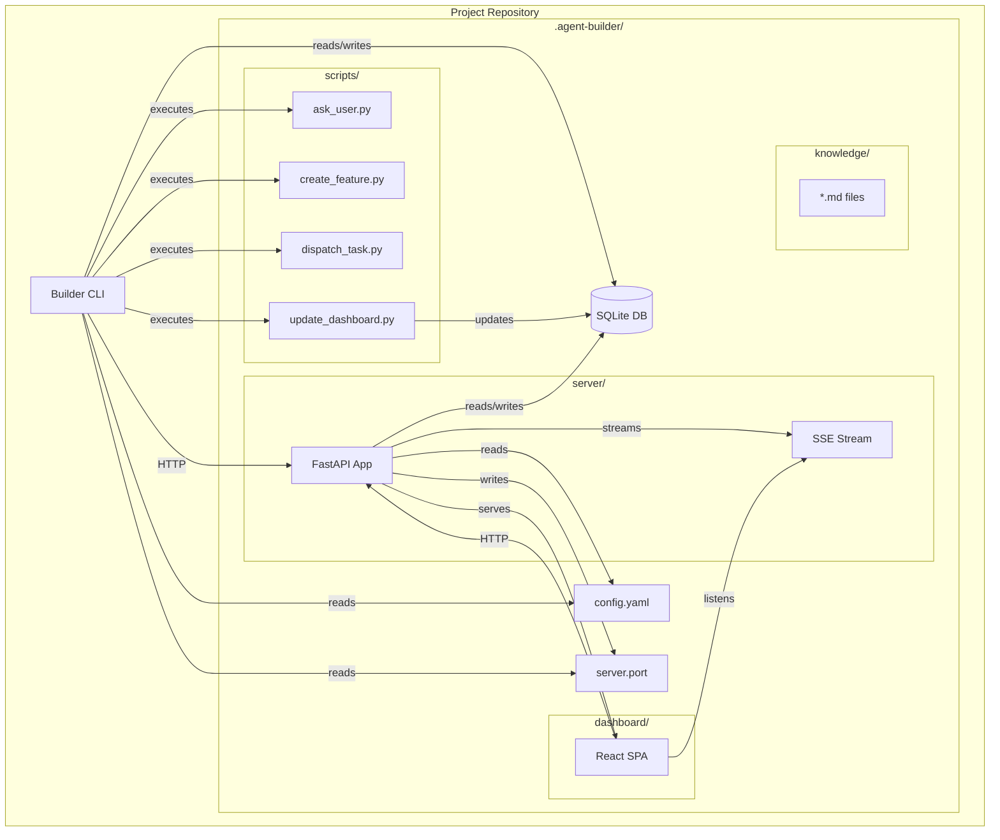
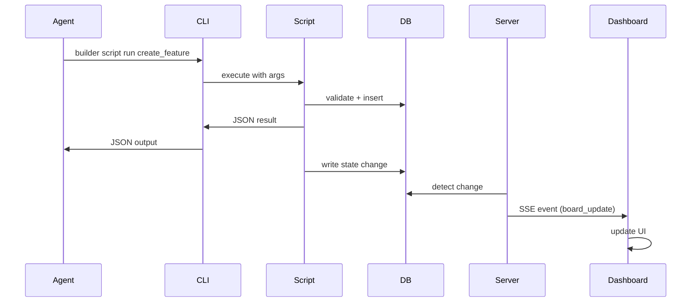

# Design Document: Project-Level Agent Builder

## Overview

This design transforms the autonomous-agent-builder from a centralized multi-project system to a project-level, agent-first CLI tool. Each repository will have its own self-contained agent builder instance with local SQLite database, embedded FastAPI server, and React dashboard. The transformation maintains backward compatibility while enabling per-project isolation, portability, and simplified deployment.

### Key Design Principles

1. **Simplicity Over Complexity**: Follow ReAct pattern rather than complex architectures (Reflexion). Keep agent interactions straightforward.
2. **Script-Based Efficiency**: Pre-built scripts for repetitive tasks minimize token usage and ensure deterministic behavior.
3. **Filesystem-First Storage**: Local SQLite + markdown files eliminate vector database complexity (proven 75% cost reduction).
4. **Real-Time Updates**: REST+SSE architecture provides streaming updates without polling overhead.
5. **Project Isolation**: Each project is self-contained and portable with no cross-project dependencies.

### Transformation Scope

**From**: Centralized system with shared database, single server instance, multi-project management
**To**: Per-project instances with local database, embedded server, isolated state

**Preserved**: CLI command structure, JSON output schemas, exit codes, agent interaction patterns
**New**: `builder init`, `builder start`, `builder script`, `builder knowledge`, `builder config`, `builder migrate`

## Architecture

### High-Level Component Diagram



### Data Flow: Agent Interaction



### SSE Streaming Architecture

```mermaid
graph LR
    subgraph "Browser"
        D[Dashboard]
        ES[EventSource]
    end
    
    subgraph "Server"
        SSE[/api/stream]
        Q[Event Queue]
        W[Workers]
    end
    
    subgraph "Database"
        DB[(SQLite)]
    end
    
    D -->|establishes| ES
    ES -->|GET /api/stream| SSE
    SSE -->|streams| ES
    
    W -->|task update| Q
    W -->|gate result| Q
    W -->|agent progress| Q
    
    Q -->|push| SSE
    W -->|writes| DB
```

## Components and Interfaces

### 1. CLI Command Structure

#### New Commands

**`builder init`** - Initialize project-level agent builder
```python
@app.command()
def init(
    project_name: str = typer.Option(None, help="Project name"),
    language: str = typer.Option("python", help="Primary language"),
    framework: str = typer.Option(None, help="Framework (django, fastapi, express, spring)"),
    force: bool = typer.Option(False, "--force", help="Reinitialize existing installation"),
    no_input: bool = typer.Option(False, "--no-input", help="Skip interactive prompts"),
) -> None:
    """Initialize agent builder in current repository."""
```

**Behavior**:
- Creates `.agent-builder/` directory structure
- Copies embedded server code from package resources
- Copies dashboard assets from package resources
- Copies script library from package resources
- Creates SQLite database with schema
- Generates default `config.yaml`
- Returns error if `.agent-builder/` exists (unless `--force`)

**`builder start`** - Start embedded server
```python
@app.command()
def start(
    port: int = typer.Option(None, help="Port (auto-detect if not specified)"),
    host: str = typer.Option("127.0.0.1", help="Host to bind"),
    debug: bool = typer.Option(False, help="Enable debug mode with auto-reload"),
) -> None:
    """Start the embedded server and dashboard."""
```

**Behavior**:
- Searches for `.agent-builder/` in current and parent directories
- Auto-detects available port (8000-8010) if not specified
- Writes assigned port to `.agent-builder/server.port`
- Launches FastAPI server with uvicorn
- Logs server URL to stdout

**`builder script`** - Script management
```python
@app.command()
def list() -> None:
    """List available scripts."""

@app.command()
def run(
    name: str,
    args: list[str] = typer.Argument(None),
    json: bool = typer.Option(False, "--json"),
) -> None:
    """Execute a script."""
```

**`builder knowledge`** - Knowledge base management
```python
@app.command()
def search(
    query: str,
    tags: str = typer.Option(None, help="Filter by tags (comma-separated)"),
    json: bool = typer.Option(False, "--json"),
) -> None:
    """Search knowledge base using grep."""

@app.command()
def add(
    title: str,
    content: str = typer.Option(None, help="Content (or read from stdin)"),
    tags: str = typer.Option(None, help="Tags (comma-separated)"),
) -> None:
    """Add knowledge entry."""
```

**`builder config`** - Configuration management
```python
@app.command()
def show(
    json: bool = typer.Option(False, "--json"),
) -> None:
    """Show current configuration."""

@app.command()
def set(
    key: str,
    value: str,
) -> None:
    """Set configuration value."""
```

**`builder migrate`** - Migration from multi-project mode
```python
@app.command()
def migrate(
    project_id: str,
    target_path: Path,
    archive: bool = typer.Option(False, "--archive", help="Archive in central DB"),
    central_db: str = typer.Option(None, help="Central database URL"),
) -> None:
    """Migrate project from central database to project-level."""
```

#### Modified Commands

All existing commands (`project`, `feature`, `task`, `gate`, `run`, `approval`, `board`, `metrics`, `kb`, `memory`) remain unchanged in structure but now:
- Search for `.agent-builder/` directory (current → parent → root)
- Connect to local SQLite database
- Return error with hint if `.agent-builder/` not found

### 2. Embedded Server Architecture

#### Package Structure
```
src/autonomous_agent_builder/
├── embedded/
│   ├── __init__.py
│   ├── server/              # Server code to copy
│   │   ├── __init__.py
│   │   ├── app.py
│   │   ├── routes/
│   │   │   ├── __init__.py
│   │   │   ├── features.py
│   │   │   ├── tasks.py
│   │   │   ├── gates.py
│   │   │   └── stream.py
│   │   └── sse/
│   │       ├── __init__.py
│   │       └── manager.py
│   ├── dashboard/           # Built React assets
│   │   ├── index.html
│   │   └── assets/
│   └── scripts/             # Pre-built scripts
│       ├── ask_user.py
│       ├── create_feature.py
│       ├── dispatch_task.py
│       └── update_dashboard.py
```

#### Server Initialization

The embedded server is a simplified version of the current FastAPI app:

```python
# .agent-builder/server/app.py
from fastapi import FastAPI
from fastapi.staticfiles import StaticFiles
from pathlib import Path

def create_app(db_path: Path, dashboard_path: Path) -> FastAPI:
    app = FastAPI(title="Agent Builder")
    
    # Initialize database connection
    init_db(db_path)
    
    # Register API routes
    app.include_router(features.router, prefix="/api")
    app.include_router(tasks.router, prefix="/api")
    app.include_router(gates.router, prefix="/api")
    app.include_router(stream.router, prefix="/api")
    
    # Serve dashboard
    app.mount("/assets", StaticFiles(directory=dashboard_path / "assets"))
    
    @app.get("/{full_path:path}")
    async def spa_fallback(full_path: str):
        return FileResponse(dashboard_path / "index.html")
    
    return app
```

#### Port Management

```python
def find_available_port(start: int = 8000, end: int = 8010) -> int:
    """Find available port in range."""
    for port in range(start, end + 1):
        with socket.socket(socket.AF_INET, socket.SOCK_STREAM) as s:
            try:
                s.bind(("127.0.0.1", port))
                return port
            except OSError:
                continue
    raise RuntimeError(f"No available ports in range {start}-{end}")

def write_port_file(port: int, agent_builder_dir: Path) -> None:
    """Write assigned port to .agent-builder/server.port."""
    (agent_builder_dir / "server.port").write_text(str(port))

def read_port_file(agent_builder_dir: Path) -> int | None:
    """Read port from .agent-builder/server.port."""
    port_file = agent_builder_dir / "server.port"
    if port_file.exists():
        return int(port_file.read_text().strip())
    return None
```

### 3. Dashboard Architecture

#### Real-Time Updates via SSE

**SSE Endpoint**: `/api/stream`

```python
# .agent-builder/server/routes/stream.py
from fastapi import APIRouter
from fastapi.responses import StreamingResponse
from sse_starlette.sse import EventSourceResponse

router = APIRouter()

@router.get("/stream")
async def stream_events(request: Request):
    """SSE endpoint for real-time updates."""
    async def event_generator():
        queue = asyncio.Queue()
        manager.register(queue)
        
        try:
            while True:
                if await request.is_disconnected():
                    break
                
                event = await queue.get()
                yield {
                    "event": event["type"],
                    "data": json.dumps(event["data"]),
                }
        finally:
            manager.unregister(queue)
    
    return EventSourceResponse(event_generator())
```

**Event Types**:
- `task_update`: Task status changed
- `gate_result`: Quality gate completed
- `agent_progress`: Agent execution progress
- `board_update`: Board state changed

**Dashboard SSE Client**:
```typescript
// frontend/src/lib/sse.ts
export function useSSE(onEvent: (event: SSEEvent) => void) {
  useEffect(() => {
    const eventSource = new EventSource('/api/stream');
    
    eventSource.addEventListener('task_update', (e) => {
      onEvent({ type: 'task_update', data: JSON.parse(e.data) });
    });
    
    eventSource.addEventListener('gate_result', (e) => {
      onEvent({ type: 'gate_result', data: JSON.parse(e.data) });
    });
    
    eventSource.addEventListener('agent_progress', (e) => {
      onEvent({ type: 'agent_progress', data: JSON.parse(e.data) });
    });
    
    eventSource.addEventListener('board_update', (e) => {
      onEvent({ type: 'board_update', data: JSON.parse(e.data) });
    });
    
    eventSource.onerror = () => {
      // Exponential backoff reconnection handled by EventSource
    };
    
    return () => eventSource.close();
  }, [onEvent]);
}
```

### 4. Script Library Design

#### Script Execution Model

Scripts are pre-built Python modules that agents can call via CLI:

```bash
builder script run create_feature --title "Add auth" --description "..." --json
```

**Benefits**:
- Deterministic behavior (no code generation)
- Token-efficient (single command vs multi-turn conversation)
- Consistent validation and error handling
- Dashboard state updates built-in

#### Script Interface Contract

All scripts follow this interface:

```python
# .agent-builder/scripts/base.py
from abc import ABC, abstractmethod
from typing import Any

class Script(ABC):
    @abstractmethod
    def run(self, args: dict[str, Any]) -> dict[str, Any]:
        """Execute script logic.
        
        Returns:
            dict with 'success' (bool), 'data' (Any), 'error' (str | None)
        """
        pass
    
    @abstractmethod
    def validate_args(self, args: dict[str, Any]) -> list[str]:
        """Validate arguments.
        
        Returns:
            List of validation errors (empty if valid)
        """
        pass
```

#### Example Scripts

**create_feature.py**:
```python
class CreateFeatureScript(Script):
    def validate_args(self, args):
        errors = []
        if not args.get('title'):
            errors.append("title is required")
        if not args.get('project_id'):
            errors.append("project_id is required")
        return errors
    
    def run(self, args):
        # Validate
        errors = self.validate_args(args)
        if errors:
            return {'success': False, 'error': ', '.join(errors)}
        
        # Create feature
        feature = Feature(
            project_id=args['project_id'],
            title=args['title'],
            description=args.get('description', ''),
            status=FeatureStatus.BACKLOG,
        )
        
        # Save to database
        db.add(feature)
        db.commit()
        
        # Update dashboard state (triggers SSE event)
        update_dashboard_state('board_update', {'feature_id': feature.id})
        
        return {
            'success': True,
            'data': {
                'id': feature.id,
                'title': feature.title,
                'status': feature.status,
            }
        }
```

**dispatch_task.py**:
```python
class DispatchTaskScript(Script):
    def run(self, args):
        task_id = args['task_id']
        
        # Load task
        task = db.query(Task).filter(Task.id == task_id).first()
        if not task:
            return {'success': False, 'error': f'Task {task_id} not found'}
        
        # Dispatch through orchestrator
        result = orchestrator.dispatch(task)
        
        # Update dashboard
        update_dashboard_state('task_update', {
            'task_id': task.id,
            'status': task.status,
        })
        
        return {
            'success': True,
            'data': {
                'task_id': task.id,
                'status': task.status,
                'run_id': result.run_id,
            }
        }
```

### 5. Database Schema

The database schema remains unchanged from the current implementation (14 tables). The only difference is storage location:

**Current**: Centralized PostgreSQL or SQLite at user level
**New**: Local SQLite at `.agent-builder/agent_builder.db`

**Schema**: Same as `src/autonomous_agent_builder/db/models.py`

**Migration Strategy**:
- Use Alembic for schema migrations
- Store migration scripts in `.agent-builder/migrations/`
- Run migrations automatically on `builder init` and server start

### 6. Configuration System

#### Configuration File Structure

`.agent-builder/config.yaml`:
```yaml
# Project metadata
project:
  name: "my-project"
  language: "python"
  framework: "fastapi"

# Agent budgets
agent:
  max_cost_per_task: 5.0  # USD
  max_turns_per_run: 50
  timeout_seconds: 300

# Quality gates
gates:
  timeout_seconds: 60
  max_retries: 2
  concurrent_execution: true
  
  # Gate-specific config
  ruff:
    enabled: true
    fix: true
  
  pytest:
    enabled: true
    coverage_threshold: 80
  
  semgrep:
    enabled: true
    rules: ["python.lang.security"]
  
  trivy:
    enabled: false  # Disabled by default (slow)

# Server
server:
  host: "127.0.0.1"
  port_range: [8000, 8010]
  debug: false

# Knowledge base
knowledge:
  auto_index: true
  search_tool: "grep"  # or "ripgrep" if available
```

#### Configuration Precedence

1. **CLI flags** (highest priority)
2. **Environment variables** (`BUILDER_*` prefix)
3. **Project config** (`.agent-builder/config.yaml`)
4. **User config** (`~/.config/agent-builder/config.yaml`)
5. **System defaults** (lowest priority)

```python
class Config:
    def __init__(self):
        self.defaults = load_defaults()
        self.system = load_system_config()
        self.user = load_user_config()
        self.project = load_project_config()
        self.env = load_env_vars()
        self.cli = {}
    
    def get(self, key: str) -> Any:
        """Get config value with precedence."""
        for source in [self.cli, self.env, self.project, self.user, self.system, self.defaults]:
            if key in source:
                return source[key]
        raise KeyError(f"Config key not found: {key}")
```

## Data Models

### Project Directory Structure

```
.agent-builder/
├── agent_builder.db          # SQLite database
├── config.yaml               # Project configuration
├── server.port               # Current server port
├── migrations/               # Alembic migrations
│   ├── alembic.ini
│   ├── env.py
│   └── versions/
│       └── *.py
├── server/                   # Embedded FastAPI server
│   ├── __init__.py
│   ├── app.py
│   ├── routes/
│   │   ├── __init__.py
│   │   ├── features.py
│   │   ├── tasks.py
│   │   ├── gates.py
│   │   └── stream.py
│   └── sse/
│       ├── __init__.py
│       └── manager.py
├── dashboard/                # React frontend (built)
│   ├── index.html
│   └── assets/
│       ├── index-*.js
│       └── index-*.css
├── scripts/                  # Pre-built agent scripts
│   ├── __init__.py
│   ├── base.py
│   ├── ask_user.py
│   ├── create_feature.py
│   ├── dispatch_task.py
│   └── update_dashboard.py
└── knowledge/                # Markdown knowledge files
    ├── architecture.md
    ├── decisions.md
    └── patterns.md
```

### Knowledge File Format

```markdown
---
title: "Feature Planning Pattern"
tags: ["planning", "feature", "pattern"]
created: "2024-01-15T10:30:00Z"
updated: "2024-01-20T14:45:00Z"
---

# Feature Planning Pattern

## Context

When planning a new feature...

## Pattern

1. Gather requirements
2. Create design document
3. Break into tasks
4. Estimate complexity

## Example

...
```

## API Design

### REST Endpoints

All existing endpoints remain unchanged:

- `GET /api/projects` - List projects
- `POST /api/projects` - Create project
- `GET /api/features` - List features
- `POST /api/features` - Create feature
- `GET /api/tasks` - List tasks
- `POST /api/tasks` - Create task
- `POST /api/tasks/{id}/dispatch` - Dispatch task
- `GET /api/gates` - List gate results
- `GET /api/runs` - List agent runs
- `GET /api/board` - Get board state
- `GET /api/metrics` - Get metrics

### SSE Endpoint

**New**: `GET /api/stream` - Server-Sent Events for real-time updates

**Event Payload Schema**:

```typescript
type SSEEvent = 
  | TaskUpdateEvent
  | GateResultEvent
  | AgentProgressEvent
  | BoardUpdateEvent;

interface TaskUpdateEvent {
  type: 'task_update';
  data: {
    task_id: string;
    status: TaskStatus;
    updated_at: string;
  };
}

interface GateResultEvent {
  type: 'gate_result';
  data: {
    task_id: string;
    gate_name: string;
    status: GateStatus;
    findings_count: number;
  };
}

interface AgentProgressEvent {
  type: 'agent_progress';
  data: {
    run_id: string;
    task_id: string;
    message: string;
    progress: number;  // 0-100
  };
}

interface BoardUpdateEvent {
  type: 'board_update';
  data: {
    reason: string;  // 'task_created' | 'task_moved' | 'feature_added'
  };
}
```

## Error Handling

### Error Messages with Hints

All error messages follow this pattern:

```python
class BuilderError(Exception):
    def __init__(self, message: str, hint: str):
        self.message = message
        self.hint = hint
        super().__init__(f"{message}\n\nHint: {hint}")

# Usage examples
raise BuilderError(
    "No .agent-builder/ directory found",
    "Run 'builder init' to initialize agent builder in this repository"
)

raise BuilderError(
    "Cannot connect to database",
    "Check that .agent-builder/agent_builder.db exists and has correct permissions"
)

raise BuilderError(
    "Server not running",
    "Start the server with 'builder start'"
)

raise BuilderError(
    "Port 8000 already in use",
    "Specify a different port with 'builder start --port 8001'"
)
```

### Exit Codes

- `0`: Success
- `1`: General failure
- `2`: Invalid command usage
- `3`: Connectivity error (server not reachable)
- `4`: Not initialized (`.agent-builder/` not found)

## Testing Strategy

### Unit Tests

**CLI Commands**:
- Test `builder init` creates correct directory structure
- Test `builder init --force` reinitializes existing installation
- Test `builder init --no-input` uses defaults
- Test `builder start` finds available port
- Test `builder start --port` uses specified port
- Test `builder script list` shows available scripts
- Test `builder script run` executes scripts correctly
- Test `builder config show` displays configuration
- Test `builder config set` updates configuration
- Test `builder knowledge search` finds entries
- Test `builder knowledge add` creates entries

**Server**:
- Test port auto-detection algorithm
- Test SSE connection establishment
- Test SSE event broadcasting
- Test SSE reconnection handling
- Test database connection from embedded server
- Test dashboard asset serving

**Scripts**:
- Test `create_feature.py` validation
- Test `create_feature.py` database insertion
- Test `dispatch_task.py` orchestrator integration
- Test `update_dashboard.py` SSE event emission

**Configuration**:
- Test precedence hierarchy (CLI > env > project > user > system)
- Test environment variable parsing
- Test config file validation

### Integration Tests

- Test full `builder init` → `builder start` → dashboard access flow
- Test agent calling `builder script run create_feature` → SSE update → dashboard refresh
- Test multi-project isolation (two projects in different directories)
- Test migration from central database to project-level
- Test knowledge search across multiple markdown files

### End-to-End Tests

- Test complete SDLC flow in project-level mode:
  1. `builder init`
  2. `builder start`
  3. Create project via CLI
  4. Create feature via script
  5. Dispatch task
  6. Verify dashboard updates in real-time
  7. Check quality gates
  8. Verify all data in local database

## Migration Strategy

### Phase 1: Dual Mode Support

Support both centralized and project-level modes:

```python
def get_database_path() -> Path:
    """Get database path based on mode."""
    # Check for project-level installation
    agent_builder_dir = find_agent_builder_dir()
    if agent_builder_dir:
        return agent_builder_dir / "agent_builder.db"
    
    # Fall back to centralized mode
    return Path.home() / ".agent-builder" / "agent_builder.db"
```

### Phase 2: Migration Command

Provide `builder migrate` to move projects:

```python
@app.command()
def migrate(
    project_id: str,
    target_path: Path,
    archive: bool = False,
    central_db: str = None,
):
    """Migrate project from central to project-level."""
    # 1. Connect to central database
    central = connect_db(central_db or get_central_db_path())
    
    # 2. Export project data
    project = export_project(central, project_id)
    
    # 3. Initialize target directory
    init_project_level(target_path)
    
    # 4. Import data to local database
    local = connect_db(target_path / ".agent-builder" / "agent_builder.db")
    import_project(local, project)
    
    # 5. Optionally archive in central
    if archive:
        mark_archived(central, project_id)
    
    # 6. Generate report
    print_migration_report(project)
```

### Phase 3: Deprecation

After migration period:
1. Add deprecation warnings to centralized mode
2. Update documentation to recommend project-level mode
3. Eventually remove centralized mode support

## Deployment Considerations

### Package Distribution

**Current**: Single package with server + CLI
**New**: Same package, but with embedded resources

```python
# setup.py / pyproject.toml
[tool.poetry]
packages = [
    { include = "autonomous_agent_builder", from = "src" }
]

[tool.poetry.package-data]
"autonomous_agent_builder.embedded" = [
    "server/**/*.py",
    "dashboard/**/*",
    "scripts/**/*.py",
]
```

### Installation

```bash
# Install package
pip install autonomous-agent-builder

# Initialize in project
cd /path/to/my-project
builder init

# Start server
builder start

# Open dashboard
open http://localhost:8000
```

### Docker Support

For containerized environments:

```dockerfile
FROM python:3.11-slim

WORKDIR /workspace

# Install builder
RUN pip install autonomous-agent-builder

# Initialize (will be done by user in mounted volume)
# VOLUME /workspace

CMD ["builder", "start", "--host", "0.0.0.0"]
```

## Security Considerations

### Database Access

- SQLite database is local to project (no network exposure)
- File permissions restrict access to project owner
- No authentication required for local access

### Server Security

- Server binds to `127.0.0.1` by default (localhost only)
- No authentication for local access
- CORS restricted to localhost origins
- SSE connections are stateless (no session management)

### Script Execution

- Scripts are pre-built and packaged (no arbitrary code execution)
- Script arguments are validated before execution
- Scripts run with same permissions as CLI user

## Performance Considerations

### Database Performance

- SQLite is sufficient for single-project workloads
- Indexes on foreign keys and status columns
- Connection pooling not needed (single-user access)

### SSE Performance

- One SSE connection per browser session
- Event queue per connection (no broadcast overhead)
- Automatic cleanup on disconnect
- No polling (push-only updates)

### Dashboard Performance

- React SPA with code splitting
- GSAP animations for smooth transitions
- Lazy loading for large task lists
- Debounced search inputs

## Backward Compatibility

### Preserved Interfaces

- CLI command structure: `builder <resource> <verb>`
- CLI flags: `--json`, `--yes`, `--dry-run`, `--full`
- Exit codes: 0, 1, 2, 3
- JSON output schemas for all commands
- API endpoint paths and response formats

### Breaking Changes

- Database location (centralized → project-level)
- Server startup (global → per-project)
- Multi-project commands removed (single project per instance)

### Migration Path

1. Install new version
2. Run `builder migrate` for each project
3. Update scripts to use project-level commands
4. Remove centralized database (optional)

## Future Enhancements

### Optional Central Server

For teams wanting cross-project visibility:

```yaml
# .agent-builder/config.yaml
sync:
  enabled: true
  central_server: "https://builder.company.com"
  api_key: "..."
  sync_interval: 300  # seconds
```

### Plugin System

Allow custom scripts and gates:

```yaml
# .agent-builder/config.yaml
plugins:
  - name: "custom-gate"
    path: "./plugins/custom_gate.py"
  - name: "slack-notifier"
    path: "./plugins/slack.py"
```

### Knowledge Embeddings (Optional)

For advanced search (opt-in):

```yaml
# .agent-builder/config.yaml
knowledge:
  search_tool: "semantic"  # Uses embeddings
  embedding_model: "text-embedding-3-small"
```

---

## Summary

This design transforms the autonomous-agent-builder into a project-level tool while maintaining backward compatibility and simplifying deployment. Key improvements:

1. **Project Isolation**: Each project is self-contained and portable
2. **Simplified Deployment**: No central server required
3. **Real-Time Updates**: SSE streaming eliminates polling
4. **Token Efficiency**: Script library reduces agent token usage
5. **Filesystem-First**: Local SQLite + markdown files (no vector DB)
6. **Agent-First CLI**: Machine-readable output, non-interactive execution
7. **Backward Compatible**: Existing commands and schemas preserved

The transformation maintains the core architecture (Claude Agent SDK, deterministic dispatch, concurrent gates) while enabling per-project autonomy and simplified operations.
