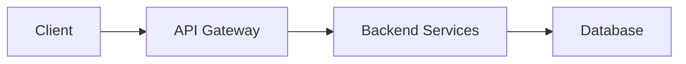

# Knowledge Base Document Format Specification

## Overview

All knowledge base documents must follow a standardized format to ensure consistency, proper parsing, and dashboard compatibility.

## File Format

- **Extension**: `.md` (Markdown)
- **Encoding**: UTF-8
- **Line Endings**: LF (Unix-style)

## Document Structure

```markdown
---
title: "Document Title"
tags: ["tag1", "tag2", "tag3"]
doc_type: "context"
created: "2026-04-17T17:01:15.292496"
auto_generated: true
version: 1
---

# Main Heading

Content goes here...

## Section Heading

More content...
```

## Frontmatter Requirements

### Required Fields

| Field | Type | Description | Example |
|-------|------|-------------|---------|
| `title` | string | Document title (max 100 chars) | `"Project Overview"` |
| `tags` | array[string] | List of tags (max 10) | `["overview", "architecture"]` |
| `doc_type` | string | Document type category | `"context"` |
| `created` | string | ISO 8601 timestamp | `"2026-04-17T17:01:15.292496"` |
| `auto_generated` | boolean | Whether auto-generated | `true` |

### Optional Fields

| Field | Type | Description | Example |
|-------|------|-------------|---------|
| `version` | integer | Document version (≥1) | `1` |
| `updated` | string | ISO 8601 timestamp of last update | `"2026-04-18T10:30:00.000000"` |
| `wikilinks` | array[string] | Links to other documents | `["api-endpoints", "architecture"]` |

### Document Types

The `doc_type` field should use one of these standard values:

| Type | Label | Use Case |
|------|-------|----------|
| `context` | Context | General project context and overview |
| `adr` | ADR | Architecture Decision Records |
| `api_contract` | API Contract | API specifications and contracts |
| `schema` | Schema | Data schemas and models |
| `runbook` | Runbook | Operational procedures |
| `reverse-engineering` | reverse-engineering | Auto-generated from codebase analysis |

**Note**: The dashboard will display `doc_type` as-is if not in the TYPE_LABELS mapping. For reverse-engineering docs, use `"reverse-engineering"` or `"context"`.

## Content Requirements

### Minimum Standards

- **Body length**: At least 100 characters (excluding frontmatter)
- **Headings**: At least one markdown heading (`#`, `##`, etc.)
- **Hierarchy**: Proper heading levels (don't skip from `#` to `###`)

### Markdown Best Practices

1. **Use proper heading hierarchy**:
   ```markdown
   # Level 1
   ## Level 2
   ### Level 3
   ```

2. **Include code blocks with language tags**:
   ````markdown
   ```python
   def example():
       pass
   ```
   ````

3. **Use lists for structured data**:
   ```markdown
   - Item 1
   - Item 2
   - Item 3
   ```

4. **Use tables for comparisons**:
   ```markdown
   | Column 1 | Column 2 |
   |----------|----------|
   | Value 1  | Value 2  |
   ```

## Dashboard Integration

### Display Format

The dashboard displays documents with:

**Card View**:
- Title (from frontmatter)
- Type badge (from `doc_type`)
- Excerpt (first 120 chars of body, excluding frontmatter and headings)
- Tags (first 3 visible, "+N more" for additional)
- Wikilink count

**Sidebar View** (when selected):
- Full title
- Type badge
- Complete content (formatted)
- Related documents (wikilinks, backlinks, similar)

### Required for Dashboard

To display properly in the dashboard, ensure:

1. ✅ Valid YAML frontmatter with all required fields
2. ✅ `title` is descriptive and concise
3. ✅ `tags` are relevant and specific
4. ✅ `doc_type` matches expected types or is descriptive
5. ✅ Content has meaningful text (not just headings)
6. ✅ Markdown is well-formatted

## Validation

### Linting Command

```bash
# Lint all documents
builder kb lint

# Strict mode (warnings as errors)
builder kb lint --strict

# Verbose output
builder kb lint --verbose

# Custom directory
builder kb lint --kb-dir custom-docs
```

### Validation Checks

The linter validates:

**Frontmatter**:
- ✅ Valid YAML syntax
- ✅ All required fields present
- ✅ Correct field types
- ✅ Valid ISO 8601 timestamps
- ✅ Non-empty strings
- ✅ Reasonable field lengths

**Content**:
- ✅ Non-empty body
- ✅ Minimum content length
- ✅ At least one heading
- ✅ Proper heading hierarchy

**Markdown**:
- ⚠️ Heading structure
- ⚠️ Code block formatting
- ⚠️ List formatting

## Generator Guidelines

When creating document generators:

1. **Use the template**:
   ```python
   from datetime import datetime
   
   frontmatter = {
       "title": "Document Title",
       "tags": ["tag1", "tag2"],
       "doc_type": "context",
       "created": datetime.now().isoformat(),
       "auto_generated": True,
       "version": 1,
   }
   ```

2. **Format consistently**:
   ```python
   content = f"""---
   title: "{frontmatter['title']}"
   tags: {frontmatter['tags']}
   doc_type: "{frontmatter['doc_type']}"
   created: "{frontmatter['created']}"
   auto_generated: {str(frontmatter['auto_generated']).lower()}
   version: {frontmatter['version']}
   ---

   # {frontmatter['title']}

   {body_content}
   """
   ```

3. **Validate before writing**:
   ```python
   from autonomous_agent_builder.knowledge.document_spec import DocumentLinter
   
   linter = DocumentLinter()
   if not linter.lint_content(content):
       print(linter.get_report())
       raise ValueError("Document failed validation")
   ```

## Examples

### Minimal Valid Document

```markdown
---
title: "Example Document"
tags: ["example"]
doc_type: "context"
created: "2026-04-17T10:00:00.000000"
auto_generated: true
---

# Example Document

This is a minimal valid document with all required fields and sufficient content.
```

### Complete Document

```markdown
---
title: "System Architecture"
tags: ["architecture", "design", "overview"]
doc_type: "context"
created: "2026-04-17T10:00:00.000000"
auto_generated: true
version: 1
wikilinks: ["api-endpoints", "database-models"]
---

# System Architecture

## Overview

This document describes the high-level architecture of the system.

## Components

### Frontend
- React with TypeScript
- Vite build system
- Tailwind CSS

### Backend
- FastAPI (Python)
- PostgreSQL database
- Redis cache

## Data Flow



## Related Documents

- [[api-endpoints]] - API specifications
- [[database-models]] - Data models
```

## Troubleshooting

### Common Issues

**Issue**: "Missing frontmatter"
- **Fix**: Ensure document starts with `---` on the first line

**Issue**: "Invalid YAML in frontmatter"
- **Fix**: Check for proper YAML syntax, quotes around strings, proper list format

**Issue**: "Missing required field 'created'"
- **Fix**: Add ISO 8601 timestamp: `created: "2026-04-17T10:00:00.000000"`

**Issue**: "Document body is very short"
- **Fix**: Add more descriptive content (at least 100 characters)

**Issue**: "No markdown headings found"
- **Fix**: Add at least one heading (`#`, `##`, etc.)

## References

- [YAML Specification](https://yaml.org/spec/)
- [ISO 8601 Timestamps](https://en.wikipedia.org/wiki/ISO_8601)
- [Markdown Guide](https://www.markdownguide.org/)
- [CommonMark Spec](https://commonmark.org/)
