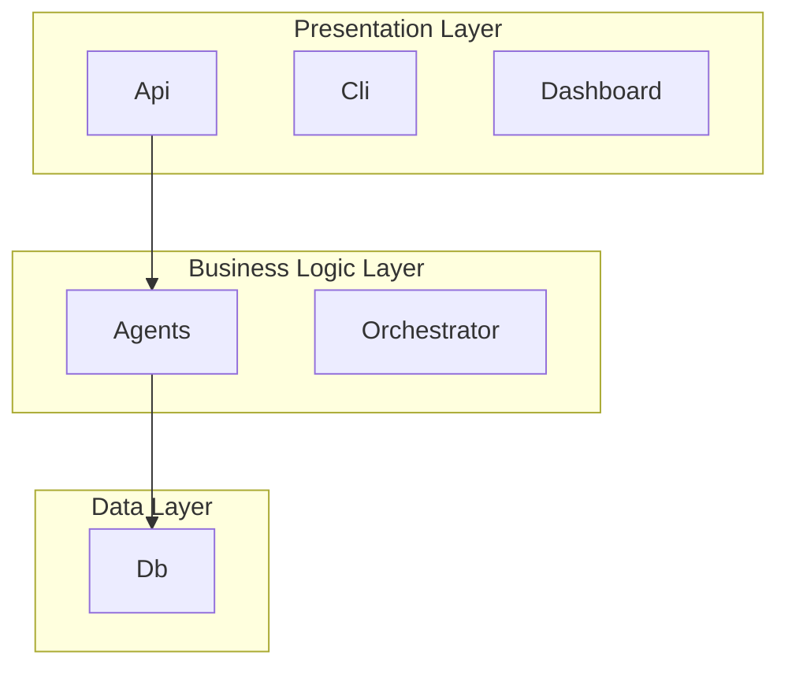

# Knowledge Extraction Feature

## Overview

The knowledge extraction feature automatically generates comprehensive project documentation by analyzing the codebase. It's inspired by AI-DLC's reverse engineering methodology but adapted for the agent builder's filesystem-based knowledge system.

## Features

### Automated Documentation Generation

The `builder kb extract` command analyzes your project and generates:

1. **Project Overview** - High-level description, languages, frameworks, directory structure
2. **Business Overview** - Domain entities, business concepts, business rules
3. **System Architecture** - Component diagrams (Mermaid), architectural layers, integration points
4. **Code Structure** - Module organization, key files, design patterns
5. **Technology Stack** - Languages, frameworks, databases, development tools
6. **Dependencies** - Production and development dependencies with versions

### Key Characteristics

- **Offline Operation**: Works without server (no API calls)
- **Filesystem-Based**: Writes directly to `.agent-builder/knowledge/reverse-engineering/`
- **Markdown Format**: Uses YAML frontmatter + markdown (consistent with existing KB)
- **Searchable**: Integrates with existing `builder kb search` and `builder kb list`
- **Incremental**: Can regenerate with `--force` flag
- **Extensible**: Easy to add new generators

## Usage

### Basic Extraction

```bash
# Extract knowledge from current project
builder kb extract

# Force regeneration
builder kb extract --force

# Custom output directory
builder kb extract --output-dir my-analysis
```

### Viewing Extracted Knowledge

```bash
# List all extracted docs
builder kb list --type reverse-engineering

# Search across all knowledge
builder kb search "architecture"

# Show specific document
builder kb show reverse-engineering/system-architecture.md
```

### JSON Output

```bash
# Get extraction results as JSON
builder kb extract --json
```

## Architecture

### Components

```
src/autonomous_agent_builder/knowledge/
├── __init__.py
├── extractor.py                    # Main extraction orchestrator
└── generators/
    ├── __init__.py
    ├── base.py                     # Base generator class
    ├── project_overview.py         # Project metadata
    ├── business_overview.py        # Domain analysis
    ├── architecture.py             # System architecture
    ├── code_structure.py           # Code organization
    ├── technology_stack.py         # Tech stack
    └── dependencies.py             # Dependency analysis
```

### Generator Pattern

Each generator:
1. Extends `BaseGenerator`
2. Implements `generate(scope: str) -> dict | None`
3. Returns document with `title`, `content`, `tags`, `doc_type`
4. Can return `None` if not applicable

### Output Format

Generated documents use YAML frontmatter:

```markdown
---
title: "System Architecture"
tags: ["architecture", "reverse-engineering", "design"]
doc_type: "reverse-engineering"
created: "2026-04-17T16:37:22.488785"
auto_generated: true
---

# System Architecture

...content...
```

## Integration with AI-DLC

### Similarities

- **Multi-package discovery**: Scans for Python, Node.js, Java projects
- **Business context**: Extracts domain entities and concepts
- **Architecture diagrams**: Generates Mermaid diagrams
- **Component inventory**: Lists all major components
- **Technology stack**: Identifies languages, frameworks, tools
- **Dependencies**: Catalogs all external dependencies

### Differences

| AI-DLC | Agent Builder |
|--------|---------------|
| Outputs to `aidlc-docs/inception/reverse-engineering/` | Outputs to `.agent-builder/knowledge/reverse-engineering/` |
| Part of full SDLC workflow | Standalone knowledge extraction |
| Requires AI-DLC workflow activation | Works independently |
| Generates 9+ documents | Generates 6 core documents |
| Includes API documentation generator | Simplified for MVP |

### Future Enhancements

To fully match AI-DLC capabilities:

1. **API Documentation Generator** - Extract REST/GraphQL APIs
2. **Component Inventory** - Detailed package relationships
3. **Code Quality Assessment** - Test coverage, linting status
4. **Staleness Detection** - Auto-regenerate when code changes
5. **Scope Filtering** - Extract by package or feature
6. **Incremental Updates** - Update only changed components

## Benefits

### For Agent Generation

- **Rich Context**: Agents understand project structure
- **Architecture Awareness**: Know component relationships
- **Business Domain**: Understand domain terminology
- **Tech Stack**: Aware of frameworks and patterns
- **API Knowledge**: Understand existing contracts

### For Developers

- **Onboarding**: New developers get instant overview
- **Documentation**: Auto-generated, always current
- **Visual Aids**: Mermaid diagrams aid understanding
- **Searchable**: Find information quickly

### For System

- **Unified Storage**: All knowledge in one place
- **Consistent Format**: Same markdown + frontmatter
- **Version Controlled**: Git tracks changes
- **Portable**: Travels with project

## Examples

### Generated Architecture Diagram



### Generated Component List

- **Agents**: Agent system - autonomous task execution
- **Api**: API layer - handles HTTP requests and responses
- **Cli**: Command-line interface
- **Dashboard**: Web dashboard - user interface
- **Db**: Database layer - data models and persistence
- **Orchestrator**: Orchestration layer - coordinates workflows
- **Quality_Gates**: Quality gates - automated checks
- **Security**: Security layer - authentication and authorization

## Implementation Notes

### Python 3.11+ Compatibility

Uses `tomllib` (built-in) or `tomli` (external) for TOML parsing:

```python
try:
    import tomli
except ImportError:
    import tomllib as tomli  # Python 3.11+
```

### Error Handling

- Generators can return `None` if not applicable
- Errors are collected and reported in metadata
- Extraction continues even if individual generators fail

### Performance

- Limits file scanning depth (max_depth=5)
- Limits file size (max 1MB per file)
- Limits results (top 10-20 items per category)
- Fast execution (~2-3 seconds for typical project)

## Testing

### Manual Testing

```bash
# Test on current project
builder kb extract

# Verify output
ls .agent-builder/knowledge/reverse-engineering/

# Test force flag
builder kb extract --force

# Test JSON output
builder kb extract --json
```

### Integration Testing

```bash
# Test with existing KB commands (requires server)
builder server start
builder kb list --type reverse-engineering
builder kb search "architecture"
builder kb show reverse-engineering/system-architecture.md
```

## Future Work

1. **Add More Generators**
   - API documentation (REST, GraphQL)
   - Database schema
   - Test coverage analysis
   - Code quality metrics

2. **Enhance Existing Generators**
   - Better business entity extraction
   - More detailed architecture analysis
   - Dependency graph visualization
   - Code pattern detection

3. **Add Automation**
   - Git hook integration (auto-extract on commit)
   - File watcher (auto-extract on save)
   - CI/CD integration (extract in pipeline)

4. **Add Intelligence**
   - Use LLM to enhance descriptions
   - Generate better business context
   - Infer relationships between components
   - Suggest improvements

## References

- [AI-DLC Reverse Engineering](../tmp/aidlc-workflows/aidlc-rules/aws-aidlc-rule-details/inception/reverse-engineering.md)
- [Knowledge Base CLI](../src/autonomous_agent_builder/cli/commands/kb.py)
- [Knowledge Base API](../src/autonomous_agent_builder/embedded/server/routes/kb.py)
